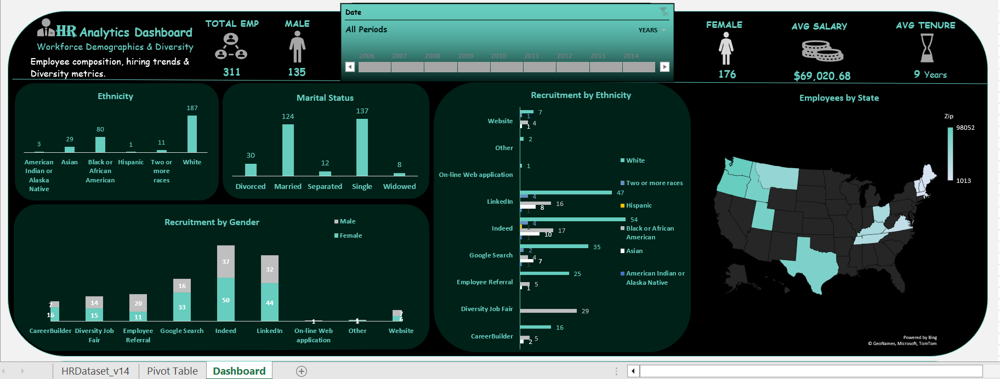
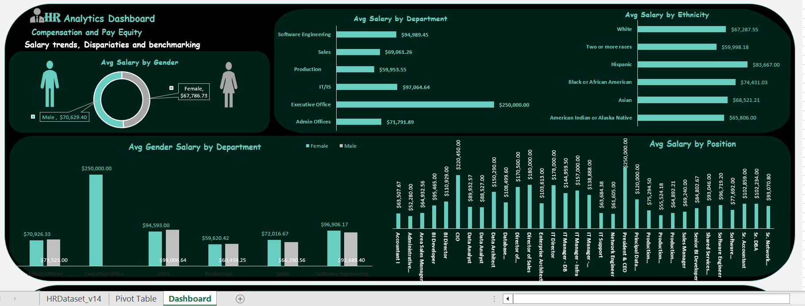
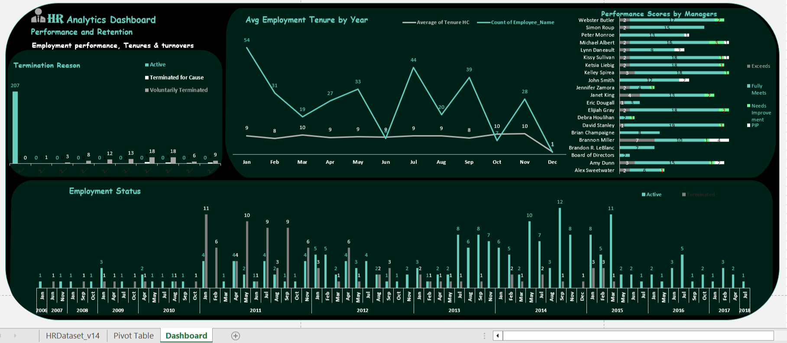
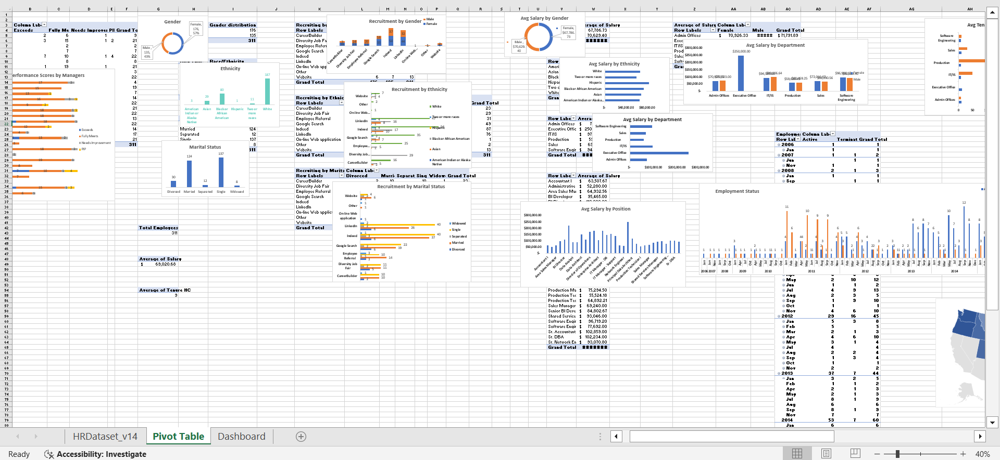

# Human Resources Data Analysis – Excel Project
Analysis on Workforce Diversity, Performance and Pay Equity

## 📌 Project Overview
This project uses the Human Resources Dataset from Kaggle to answer critical HR business questions while practicing Excel data cleaning, analysis, and visualization skills.

### The objective is to:
- Clean and prepare the dataset
- Create helper columns for analysis
- Answer questions using pivot tables & charts
- Develop KPIs
- Summarize findings.

---
## 🛠 Tools Used
- Microsoft Excel (Pivot Tables, Charts, Conditional Formatting & Formulas)
- GitHub for documentation
- Kaggle for dataset source

 ---
## 📂 Dataset Information
- Source: [Human Resources Dataset – Kaggle]
- File: HRDataset_v14.csv
- Rows: 311
- Columns: 35 (various HR details like Employee Name, Department, DOB, Termination Date, Performance Score, etc.)
 
---
## 🧹 Data Cleaning & Preparation
Data cleaning was done entirely in Excel before analysis.
### 1. Converted Dataset to an Excel Table
- Selected the entire dataset → Insert → Table.
- This allows for structured referencing and easy filtering.
### 2. Data Type Conversion; 
- Salary column changed to currency 💲 data type.
- State column, using the **find and replace** function, used to correct the wrong abbreviation of state column to full state name to enable map 🗺️.
### 2. Helper Columns
We added the following calculated fields for analysis:
#### a) Tenure (in Years)
Formula:
``=ROUND((IF(ISBLANK([DateofTermination]), TODAY (), [DateofTermination])-[DateofHire]) /365, 1)``
(ISBLANK ensures empty cells are correctly detected and Avoids Excel’s default 1/0/1900 issue for empty date cells.)
#### b) Employment Status
To indicate whether an employee is active or terminated:
excel
``=IF(ISBLANK([@DateofTermination]),"Active","Terminated")`
#### c) Age
To calculate employee age from DOB:
`excel 
``=ROUND DOWN((TODAY()-[DOB]) / 365, 0)`
#### d) Termination
``=IF(ISBLANK([@DateofTermination]),0 ,1)``

---

## 📊 Analysis Questions / Insights
Questions were answered using Pivot Tables & Charts:

**Q1: Is there a relationship between who a person works for and their performance score?**

Pivot Table: ManagerName (Rows) vs. PerformanceScore (Values = Count).
Across managers, the majority of employees have a “Fully Meets” performance rating, with “Needs Improvement” cases being rare with the highest count for a manager is only 3.

**Q2: What is the overall diversity profile of the organization?**

Pivot Table: RaceDesc & Gender distribution.
The workforce consists of 43% male and 57% female employees. The majority race is White (45%), followed by Black or African American (30%), Asian (15%), and others. Most employees are single (137), while (124) are married and the rest are divorced or separated.

**Q3: What are the best recruiting sources for ensuring a diverse organization?**

Pivot Table: RecruitmentSource vs. RaceDesc.
LinkedIn, indeed and Google search were top sources for hiring racially diverse candidates. Diversity job fair recruitment favored Black American or African 

**Q4: Are there areas of the company where pay is not equitable?**

Analysis shows that while the overall average pay is $69,020.68 
notable disparities exist.

---

## 📈 KPIs
Created KPI Cards from Employee Pivot Table:

- Total Employees
- Average Age
- Average Tenure
- Gender Split 

---

## 📊 Dashboard Layout
### Page 1: Workforce Demographics & Diversity  
**Focus: Employee composition, hiring trends, and diversity metrics.**
Metrics:  
1. Gender Distribution (Current workforce)  
2. Ethnicity Distribution (Current workforce)  
3. Marital Status Distribution  
4. Recruitment by Gender (Hiring trends)  
5. Recruitment by Ethnicity  
6. Recruitment by Marital Status  
7. Employees by Country/State (Geographic distribution)    

Why?
This page helps track diversity, equity, and inclusion (DEI) goals, hiring biases, and workforce representation across locations.

---

### Page 2: Compensation & Pay Equity  
**Focus: Salary trends, disparities, and benchmarking.**
Metrics:  
1. Average Salary by Gender  
2. Average Salary by Ethnicity  
3. Average Salary by Department  
4. Average Salary by Position  
5. Average Salary by Department Gender Difference (Pay gap analysis)  

Why?  
Highlights pay equity issues, departmental budget alignment, and potential biases in compensation.

---

### Page 3: Performance & Retention  
**Focus: Employee performance, tenure, and turnover.** 
Metrics:  
1. Performance Scores by Managers  
2. Employment Status (Active, contract, part-time, etc.)  
3. Average Tenure by Employees  
4. Average Employment Tenure by Year (Trends)  
5. Termination Reasons (Voluntary/involuntary, attrition drivers)  

Why?  
Identifies retention risks, managerial effectiveness, and longevity trends to reduce turnover.

### PivotTable

---

## 📂 Project Files
Excel file: HRDataset_v14.xlsx

## Linkedin
https://www.linkedin.com/in/okafor-sopuluchukwu-toby-456693214
